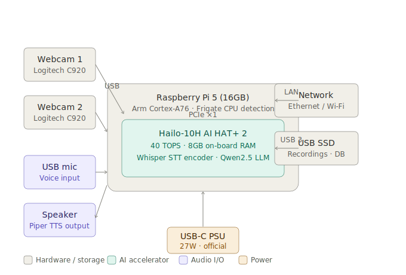
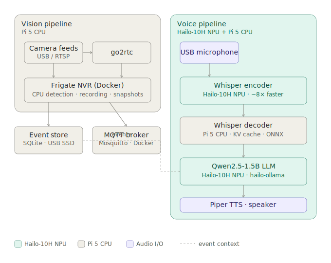

# 🦅 Argus

[](LICENSE)
[](https://huggingface.co/spaces/YOUR_HF_USERNAME/argus)

**Fully local AI camera system — Frigate NVR + Hailo-8 voice assistant on a Raspberry Pi 5.**

Argus watches your cameras, detects objects, and answers questions about what it has seen — entirely on-device. No cloud, no subscriptions, no data leaving your home.

```
Cameras ──► Frigate NVR (CPU detection) ──► Event store (SQLite + MQTT)
                                                        │
Microphone ──► Whisper STT (Hailo-8) ──► Local LLM (Hailo-8) ──► Piper TTS ──► Speaker
```

## System diagrams

### Hardware



### Software and data flow



## Hardware

| Component | Part | Notes |
|---|---|---|
| SBC | Raspberry Pi 5 (16GB) | 8GB also works |
| AI accelerator | Raspberry Pi AI HAT (Hailo-8, 13 TOPS) | Runs STT + LLM locally |
| Storage | USB SSD ≥256GB | SD cards wear out under continuous writes |
| Camera | Any UVC USB webcam | Logitech C920/C922 recommended |
| Microphone | Any USB microphone | |
| Speaker | USB or 3.5mm | |

> **Note:** Frigate officially supports Hailo-8/8L for object detection.
> Currently, Argus runs Frigate detection on the Pi 5 CPU while the voice pipeline
> (STT + LLM) runs fully accelerated on the Hailo-8.

## Quick start

```bash
git clone https://github.com/YOUR_USERNAME/argus.git
cd argus

# 1. System setup (Docker, audio deps, webcam check)
chmod +x scripts/setup.sh && ./scripts/setup.sh

# 2. Install Hailo-8 drivers and hailo-ollama
chmod +x scripts/install_hailo.sh && ./scripts/install_hailo.sh
# System reboots — SSH back in and continue

# 3. Download Whisper model assets and Piper voice model
chmod +x scripts/download_models.sh && ./scripts/download_models.sh

# 4. Configure
cp .env.example .env && nano .env

# 5. Install voice assistant Python deps
pip install -r voice/requirements.txt --break-system-packages

# 6. Start Frigate
docker compose up -d

# 7. Start the voice assistant
python voice/assistant.py
```

Frigate web UI: `http://argus.local:8971`

> **First time?** See the full step-by-step setup guide below.
> If you hit issues, check [docs/troubleshooting.md](docs/troubleshooting.md).

## Full setup guide

### 1. Flash the OS

Use [Raspberry Pi Imager](https://www.raspberrypi.com/software/) to write
**Raspberry Pi OS Trixie Lite (64-bit)** to your boot media.

In Raspberry Pi Imager → Edit Settings before writing:
- Hostname: `argus`
- Enable SSH
- Set username and password
- Configure Wi-Fi (or skip for Ethernet)

### 2. First boot

```bash
ssh pi@argus.local
sudo apt update && sudo apt full-upgrade -y
sudo reboot
```

### 3. Mount the USB SSD

```bash
lsblk                              # find your SSD — usually /dev/sda
sudo mkfs.ext4 /dev/sda1           # WARNING: erases the drive
sudo mkdir -p /mnt/recordings
sudo mount /dev/sda1 /mnt/recordings
echo '/dev/sda1 /mnt/recordings ext4 defaults,nofail 0 2' | sudo tee -a /etc/fstab
```

Set `RECORDINGS_PATH=/mnt/recordings/frigate` in `.env`.

### 4. Clone and run setup

```bash
git clone https://github.com/YOUR_USERNAME/argus.git
cd argus
chmod +x scripts/setup.sh && ./scripts/setup.sh
```

### 5. Install Hailo driver

```bash
chmod +x scripts/install_hailo.sh && ./scripts/install_hailo.sh
```

The Pi reboots. SSH back in and verify:

```bash
ls -l /dev/hailo0
hailortcli fw-control identify
```

### 6. Install hailo-ollama

hailo-ollama requires downloading the GenAI model zoo `.deb` from
[hailo.ai/developer-zone](https://hailo.ai/developer-zone) (free registration).

```bash
# After downloading hailo_gen_ai_model_zoo_X.X.X_arm64.deb:
sudo dpkg -i hailo_gen_ai_model_zoo_*.deb

# Start hailo-ollama and pull the LLM
hailo-ollama &
curl -s http://localhost:8000/api/pull \
  -H 'Content-Type: application/json' \
  -d '{"model": "qwen2.5:1.5b", "stream": false}'
```

Then enable as a service so it starts on boot:

```bash
sudo systemctl enable hailo-ollama
sudo systemctl start hailo-ollama
```

### 7. Download Whisper and TTS models

```bash
chmod +x scripts/download_models.sh && ./scripts/download_models.sh
```

### 8. Configure

```bash
cp .env.example .env
nano .env
```

Key settings:
- `RECORDINGS_PATH=/mnt/recordings/frigate`
- `WEBCAM_DEVICE=/dev/video0` (verify with `ls /dev/video*`)
- `AUDIO_INPUT_DEVICE=0` (verify with `arecord -l`)
- `HAILO_OLLAMA_MODEL=qwen2.5:1.5b`

### 9. Start Frigate

```bash
docker compose up -d
docker compose logs -f frigate
```

Open `http://argus.local:8971` — log in with the admin credentials printed
in the logs on first start. Change the password under Settings → Users.

### 10. Start the voice assistant

```bash
pip install -r voice/requirements.txt --break-system-packages
python voice/assistant.py
```

Press **ENTER** to start recording, **ENTER** again to stop.

## Stopping and starting

```bash
# Stop
docker compose down

# Start
docker compose up -d

# Status
docker compose ps

# Live logs
docker compose logs -f frigate
```

## Project structure

```
argus/
├── docker-compose.yml
├── .env.example
├── config/
│   ├── frigate.yml             # Frigate 0.17 compatible config
│   └── mosquitto.conf
├── voice/
│   ├── assistant.py            # Main push-to-talk loop
| stt.py                  # Hailo-8 hybrid Whisper STT
│   ├── llm.py                  # hailo-ollama LLM client
│   ├── tts.py                  # Piper TTS wrapper
│   ├── frigate_events.py       # SQLite + MQTT event queries
│   ├── requirements.txt
│   └── README.md
├── scripts/
│   ├── setup.sh
│   ├── install_hailo.sh
│   └── download_models.sh
├── docs/
│   ├── hardware-diagram.svg
│   ├── software-diagram.svg
│   ├── cameras.md
│   └── troubleshooting.md
├── huggingface/
│   ├── app.py                  # Gradio demo Space
│   ├── README.md
│   └── requirements.txt
└── .github/workflows/
    └── validate.yml
```

## Contributing

PRs welcome. Open an issue before starting significant work.

## Licence

Apache 2.0 — see [LICENSE](LICENSE)
